<h1 align="center">Rodrigo Barrios</h1>

Telecommunications Engineer • 4G/5G • Golang • Observability • QA Automation

---

## 🚀 OM Module

A cloud-native **Operations & Maintenance (O&M) module** for 4G/5G core testbeds.

- 📊 Prometheus metrics exporter
- 📜 Centralized log monitoring
- 🔎 Observability for AMF, SMF, UPF and RAN components
- 🐳 Docker-based deployment
- ⚙️ Built in Go

  

---

## 📚 Currently Learning

- 🎭 Playwright for QA automation and end-to-end testing

---

## 📊 GitHub Stats

  
  

---
